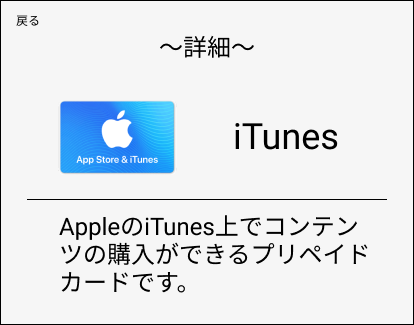
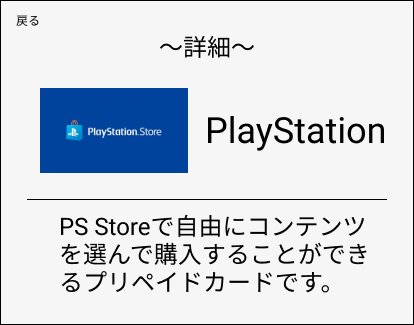
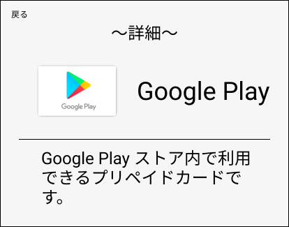
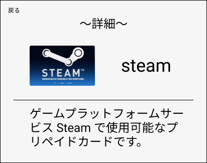

### 画面詳細
## 詳細画面
### プロトタイプは以下のリンク先
[プロトタイプ](https://www.figma.com/file/IhY27LOwgtwBdPqiLC5lNT/gamensyousai?node-id=2%3A0)
*****

*****
補足：対応DBの列はDB設計後、〇を対応するテーブル・カラム名に差し替えること

|ID|要素|内容|アクション|イベント|対応DB|
|--|----|---|---------|--------|-----|
|1 |戻る|テキスト|クリック|トップページ|-|
